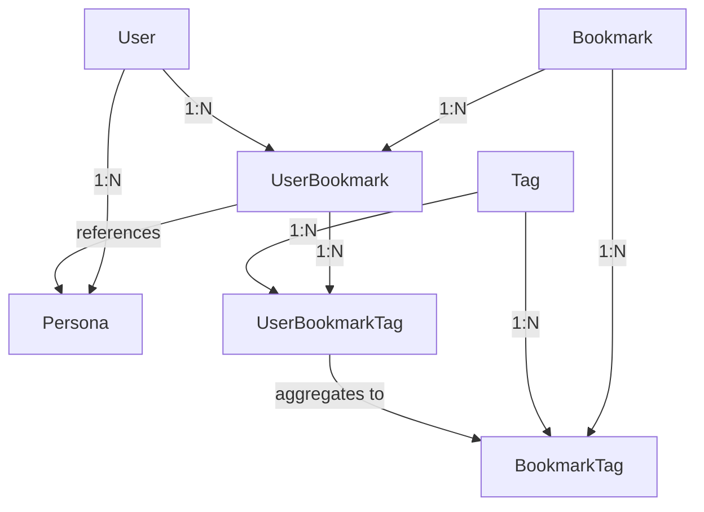

# Schemas Package

This package contains all Zod schemas that define the data models for the Bookmarker AI platform.
All types in the system are derived from these schemas.

## Core Principles

1. **Single URL Entry**: Each unique URL is stored only once in the database
2. **User Privacy**: User notes are always private, bookmark associations are private by default
3. **Parse, Don't Validate**: Use `.safeParse()` for external data, not `.parse()`
4. **YAGNI**: Only essential fields are included

## Models

### Bookmark

Represents a unique URL in the system. Only one entry exists per URL, regardless of how many users
bookmark it.

```typescript
{
  id: uuid
  url: string (valid URL)
  title: string
  createdAt: datetime
  updatedAt: datetime
}
```

### UserBookmark

Represents a user's relationship with a bookmark. This is where user-specific data is stored.

```typescript
{
  id: uuid
  userId: uuid (references User)
  bookmarkId: uuid (references Bookmark)
  notes: string | null (always private)
  isPublic: boolean (default: false, controls visibility of association)
  personaId: uuid | null (which persona suggested tags, if any)
  createdAt: datetime
  updatedAt: datetime
}
```

**Privacy Model:**

- `notes`: Always private, never exposed to other users
- `isPublic: false`: Other users cannot see this user has bookmarked this URL
- `isPublic: true`: Other users can see this user has bookmarked this URL (and their tags)

### Tag

Represents a unique tag in the system (global, normalized).

```typescript
{
  id: uuid
  name: string (normalized: lowercase, trimmed)
  createdAt: datetime
  updatedAt: datetime
}
```

### UserBookmarkTag

Represents a tag applied by a user to their bookmark. Junction table with timestamps for tracking.

```typescript
{
  id: uuid
  userBookmarkId: uuid (references UserBookmark)
  tagId: uuid (references Tag)
  createdAt: datetime (when user applied this tag)
  updatedAt: datetime
}
```

### BookmarkTag

Aggregates tag usage across all users for a bookmark. This enables tag-based discovery and ranking.

```typescript
{
  id: uuid
  bookmarkId: uuid (references Bookmark)
  tagId: uuid (references Tag)
  count: number (how many users applied this tag)
  lastAppliedAt: datetime (for trending/recent activity)
  createdAt: datetime
  updatedAt: datetime
}
```

**Tag Aggregation Logic:**

- When a user adds a tag via UserBookmarkTag, increment count in BookmarkTag
- When a user removes a tag, decrement the count
- If count reaches 0, remove the BookmarkTag entry
- Update lastAppliedAt for trending calculations

### User

Represents a user account.

```typescript
{
  id: uuid
  email: string (valid email)
  username: string (min 3 chars)
  createdAt: datetime
  updatedAt: datetime
}
```

### Persona

Represents an AI persona that can suggest tags and analyze bookmarks.

```typescript
{
  id: uuid
  name: string (min 1 char)
  systemPrompt: string (min 1 char)
  userId: uuid (references User)
  createdAt: datetime
  updatedAt: datetime
}
```

## Relationships



- One Bookmark can have many UserBookmarks (many users can save the same URL)
- One UserBookmark can have many UserBookmarkTags (user's tags with timestamps)
- Tags are global entities (normalized)
- UserBookmarkTag tracks when each user applied each tag
- BookmarkTag aggregates all users' tags for a bookmark
- Personas belong to Users and can be referenced by UserBookmarks

## Key Features

### Tag-Based Discovery

- Browse bookmarks by tag, sorted by tag frequency (most tagged first)
- Search for bookmarks with multiple tags (AND queries)
- See which tags are trending across all users
- Tags are normalized for consistency (lowercase, trimmed)

### Privacy Controls

- User notes are always private
- Users choose if their bookmark association is public or private
- Private bookmarks don't contribute to public tag counts

## Usage

```typescript
import { BookmarkSchema, UserBookmarkSchema, BookmarkTagSchema } from '@bookmarker/schemas'

// Parse external data
const bookmarkResult = BookmarkSchema.safeParse(externalData)
if (!bookmarkResult.success) {
  // Handle parsing error
  return
}

// Create types for DTOs
type CreateBookmark = z.infer<typeof CreateBookmarkSchema>
type UpdateUserBookmark = z.infer<typeof UpdateUserBookmarkSchema>

// Query bookmarks by tag frequency
// SELECT * FROM bookmarks b
// JOIN bookmark_tags bt ON b.id = bt.bookmark_id
// WHERE bt.tag_name = 'javascript'
// ORDER BY bt.count DESC
```

## Future Considerations

As the application grows, we may need to add:

- Bookmark metadata (favicon, description, etc.) - fetched async, cached separately
- User preferences and settings
- Persona configuration (temperature, max tags, etc.)
- Social features (following, collections, etc.)

These will be added only when needed, following YAGNI principles.
